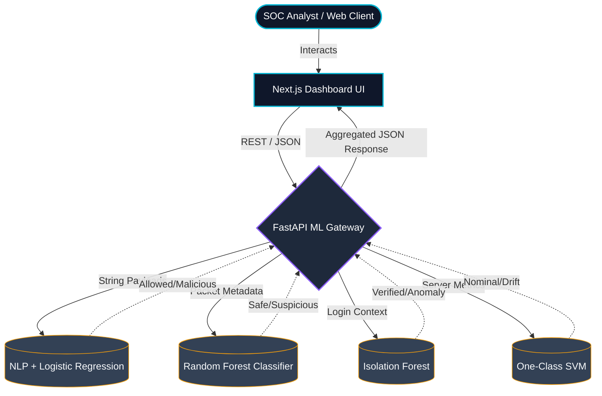

# 🛡️ AegisZero: AI-Powered Security Operations Center


AegisZero is a modern, decoupled Artificial Intelligence application security module. It utilizes lightweight, high-performance machine learning models to analyze web traffic, detect intrusions, authenticate users via behavioral biometrics, and monitor systemic anomalies in real-time.

## 🧠 Core Intelligence Modules

AegisZero replaces traditional, static rule-based firewalls with four dynamic ML models:

1. **Data Payload Inspector (Threat Detection):** Utilizes Natural Language Processing (NLP) and Logistic Regression to vectorize and classify incoming web requests, preventing SQL Injection (SQLi) and Cross-Site Scripting (XSS).
2. **Network Activity Monitor (Intrusion Detection):** Employs a Random Forest Classifier to analyze tabular packet metadata (session duration, protocol, volume) to detect DDoS floods and port scanning.
3. **Identity & Access Gateway (Secure Auth):** Leverages an Isolation Forest algorithm to establish risk-based authentication (RBA), evaluating spatial and temporal login anomalies to trigger multi-factor authentication.
4. **System Behavior Anomaly Engine:** Uses an Unsupervised One-Class Support Vector Machine (SVM) to baseline normal application traffic and detect post-breach behavioral drift or data exfiltration attempts.

---

## 🏗️ System Architecture

The system utilizes a decoupled architecture, separating the Next.js UI from the FastAPI machine learning inference engine.



---

## 🛠️ Technology Stack

**Frontend (Security Operations Center):**
* **Framework:** Next.js 14 (App Router)
* **Styling:** Tailwind CSS (Deep Dark Mode)
* **Animations:** Framer Motion (Entry and Layout transitions)
* **Icons:** Lucide-React

**Backend (Inference Engine):**
* **Framework:** FastAPI (Python)
* **Server:** Uvicorn (ASGI)
* **Data Processing:** Pandas, NumPy
* **Machine Learning:** Scikit-Learn
* **Model Serialization:** Joblib

---

## 🚀 Getting Started

### 1. Model Training Phase
Before starting the servers, the machine learning models must be trained and serialized.

```bash
cd backend
python -m venv venv
source venv/bin/activate  # On Windows use `venv\Scripts\activate`
pip install -r requirements.txt

# Generate the .pkl model files
python train_threat_model.py
python train_intrusion_model.py
python train_auth_model.py
python train_behavior_model.py
```

### 2. Launch the Backend API
Keep the virtual environment activated.
```bash
uvicorn main:app --reload
# API will be live at http://localhost:8000
```

### 3. Launch the Frontend Dashboard
Open a new terminal window.
```bash
cd frontend
npm install
npm run dev
# Dashboard will be live at http://localhost:3000
```

---

## ☁️ Deployment Configuration

AegisZero is container-ready. The Next.js frontend is heavily optimized for zero-config edge deployment on Vercel. The FastAPI backend includes a `render.yaml` and `Procfile`, making it trivial to spin up the ML inference engine on Render or Railway, ensuring the Python worker environments stay isolated from the client-facing UI.
